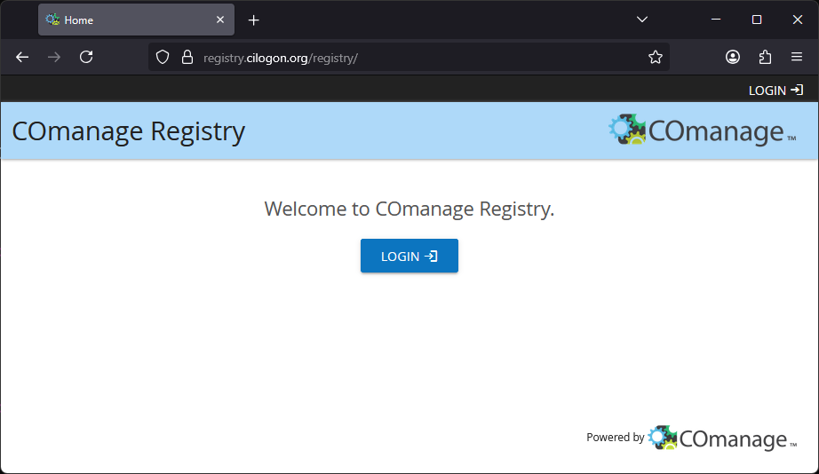
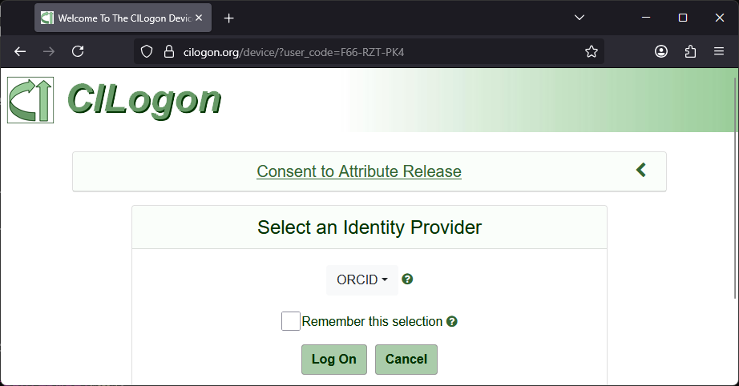
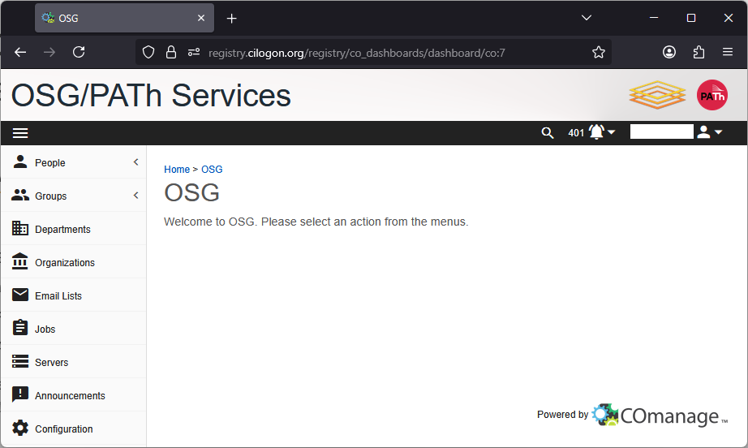
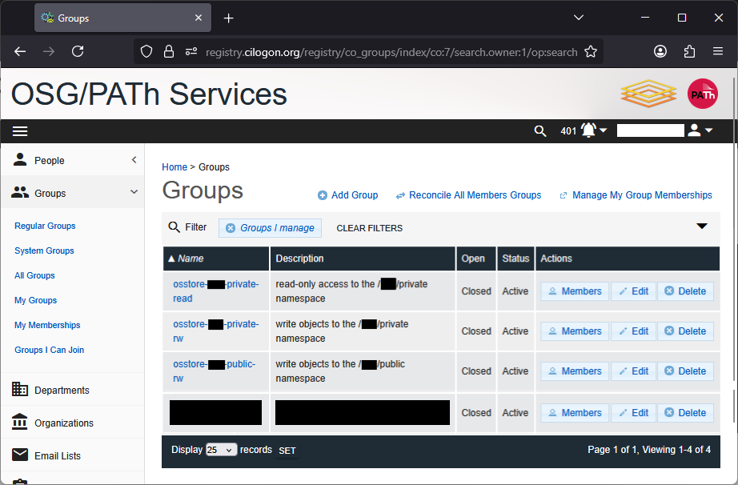
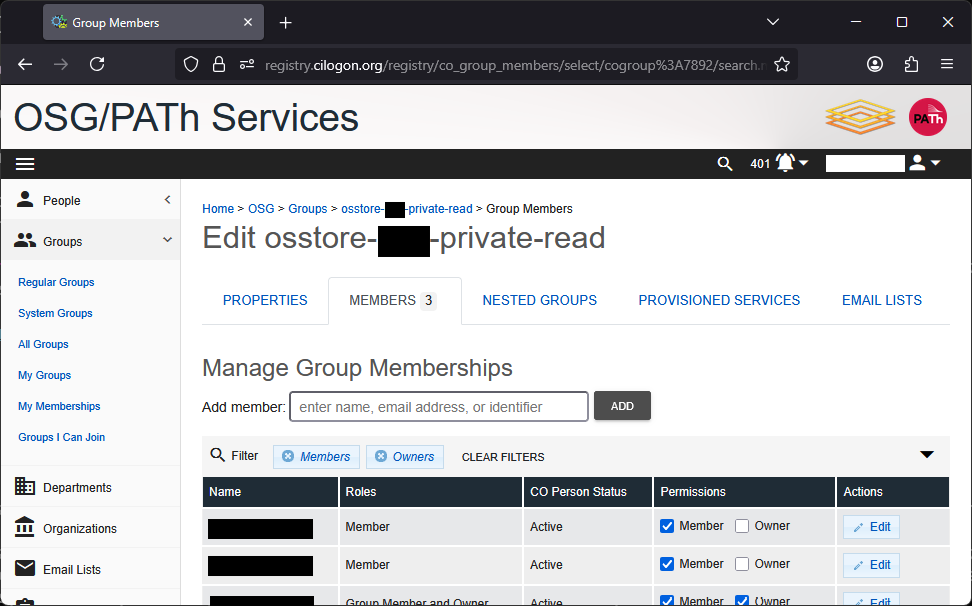
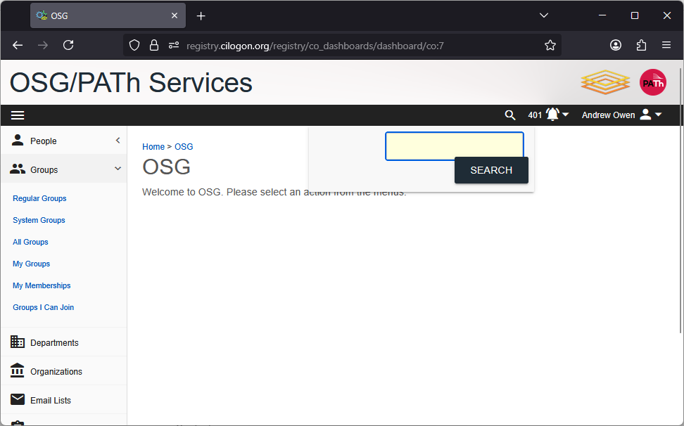

# Manage collaborator access

!!! abstract

    The OSDF currently uses [COmanage](https://incommon.org/software/comanage/) 
    for managing access to authenticated namespaces.

    In this guide, you'll learn

    * how to login to the COmanage registry
    * how to find the groups that grant access to your namespace
    * how to give collaborators access to your namespace

This guide is intended for users who manage a custom namespace in the OSDF,
usually set up in coordination with the OSDF team.
If you were not directed to this page by a member of the OSDF team,
the following instructions likely do not apply to you.

For assistance, consider emailing the OSDF team at <a href="mailto:support@osg-htc.org">support@osg-htc.org</a>.

## Login to COmanage

This section covers how to login to COmanage.
These instructions assume that you have registered your identity with COmanage previously,
which should be the case if you are the manager of a custom namespace.

1. Go to [registry.cilogon.org](https://registry.cilogon.org).

    

2. Click on the "LOGIN" button.

3. On the CILogon page, select the appropriate identity provider and click "Log On".
    Typically, this is the same identity provider you used when you first registered in COmanage.

    !!! tip
    
        We recommend that you do not click the "Remember this selection" box until after you've
        done several successful authentications. It can be tricky to "undo" this box, so it is
        best to make sure everything is working first!

    

4. Sign in to your selected identity provider as you normally would.
    You may be automatically logged in, depending on your browser settings.

You should see the following page once you've successfully logged in:

## COmanage groups that you manage

To see the COmanage groups that you manage:

1. Open the left-side navigation menu.
2. Click on the "Groups" dropdown.
3. Click on the "My Groups" link in the dropdown.
4. In the filter bar at the top of the group list, remove the filter "Groups I'm a member of" by clicking on it.

Alternatively, [use this link](https://registry.cilogon.org/registry/co_groups/index/co:7/search.owner:1/op:search) to get to the same page.
You should see something like this:

There are up to three groups (per namespace) that you can manage:

* `osstore-NAMESPACE-private-read`
* `osstore-NAMESPACE-private-rw`
* `osstore-NAMESPACE-public-rw`

Membership of these groups in COmanage controls the corresponding permissions that an identity has for interacting with the namespace via the OSDF and Pelican:

* Members of the `private-read` namespace can download objects in the `osdf:///YOUR_NAMESPACE/private` address, but cannot write/upload.
* Members of the `private-rw` namespace can both download and upload objects in the `osdf:///YOUR_NAMESPACE/private` address.
* Members of the `public-rw` namespace can upload objects in the `osdf:///YOUR_NAMESPACE/public` address.

!!! note

    There is not a group for controlling who can download objects from the `osdf:///YOUR_NAMESPACE/public` address, because **anyone** can download objects from that address!

You can see the members of a group by clicking on the "Members" icon for that group's row.
This will take you to a page like the following:

On this page, you can see the current list of members of the group and their permissions within the group.

* A "member" of the group can interact with the namespace as described above.
* An "owner" of the group can manage the membership of the group and their permissions within COmanage.

## Find collaborators in COmanage

Since your collaborator must be registered with COmanage before you can add them to your group,
it's a good idea to check and see if they are registered or not!

We suggest searching for your collaborator's email address using the global search.
Click on the magnifying glass (:material-magnify:) in the top righthand side to open the search bar:

You can also go to main search page using [this link](https://registry.cilogon.org/registry/co_dashboards/search?q=&co=7).

Then enter your collaborator's email address and click the "SEARCH" button (or hit the Enter key).

* If there is **no** identity registered with the email, you'll see a mostly empty page with the text "No results found". 
    In this case, you will need to [invite your collaborator](#invite-collaborators-to-join-comanage) to register with COmanage.

* If there is **one** identity registered with the email, you'll be automaticaly redirected to that identity's "CO Person" page.
    You can now add the collaborator to your COmanage group using this email, following the [instructions below](#add-collaborators-to-your-comanage-group).

* If there are **multiple** identities registered with the email, you'll see a list of the identities registered with that email address.
    You will need to choose one of the identities to add to your COmanage group.

??? warning "Multiple identities"

    Ideally, the COmanage registry is intended to have **one** identity registered per person. 
    In practice, however, there can be several reasons why someone has multiple identities registered. 

    It is possible to consolidate identities into one to help avoid confusion.
    Reach out to <a href="mailto:support@osg-htc.org">support@osg-htc.org</a> for assistance.

## Invite collaborators to join COmanage

If you can't find your collaborator's identity using the COmanage search, you likely need to invite them to register with COmanage.

To do so, send your collaborator an email like the following:

> Dear colleague,
> 
> In order for me to give you access to my OSDF namespace, I will need you to register using this link: __LINK_TBD__ .
> 
> When asked to login, select your institution from the list of identity providers and you will be redirected to login via your institution.
> 
> __other_tasks_TBD__
> 
> Let me know once this task is complete and I will give you access to my OSDF namespace.
> 
> For help, see the guide here: https://osdf-docs.osg-htc.org/register-with-comanage.
> Or contact support@osg-htc.org for more assistance.
> 
> Regards,

After they have registered, confirm that you can [find them in COmanage](#find-collaborators-in-comanage).
Then you can proceed to [add them to your COmanage group](#add-collaborators-to-your-comanage-group).

## Add collaborators to your COmanage group

**Your collaborator must be registered with COmanage before you can add them to your group!**
If they are not, follow [these instructions](#invite-collaborators-to-join-comanage) to invite them.

Once you've determined your collaborator's identity in COmanage, you can add them to your group.

1. Go to the [group membership page](#comanage-groups-that-you-manage) that you want to add your collaborator to.
2. In the text box after "Add member:", type the email address or other identifier of your collaborator.
3. The search box will update with a list of matching members; ideally there is only one identity in the list.
4. Click the identity corresponding to your collaborator. The name of that identity will appear in bold where the search box was previously.
5. Click the "Add" button to add the identity to the group.

The group member list will update and you will see the collaborator listed as a "member" of the group.
You can further modify their membership as described next.

## Manage members of your COmanage group

From the [group membership page](#comanage-groups-that-you-manage), you can manage the members of your group and the nature of their membership.

For each member of the group, the row in the table has a pair of checkboxes that show whether the identity is considered a "member" and an "owner". 
You can check/uncheck these boxes as desired:

* New members that you add will automatically have the "member" box checked.
* Check the "owner" box to give the member the ability to add other collaborators to this group.
* If the both the "member" and "owner" box are unchecked, the member will be **removed** from the group.

**The changes to the checkboxes will only be saved when you hit the "SAVE" button at the bottom of the table**.

You can also control *when* the membership is valid. 
That is, you can set an expiration date.
To do so, 

1. Click the "Edit" button in the right-most column for the user you want to edit.
2. Click the entry box for "Valid From" to bring up a calendar prompt; the date you choose will be the start date of the membership.
    (If you want the membership to start immediately, you can leave this box blank.)
3. Click the entry box for "Valid Through" to bring up a calendar prompt; the date you choose will be the last day the membership is valid.
4. Click the "SAVE" button once you are satisfied with the changes. To discard your changes, navigate away from this page.

